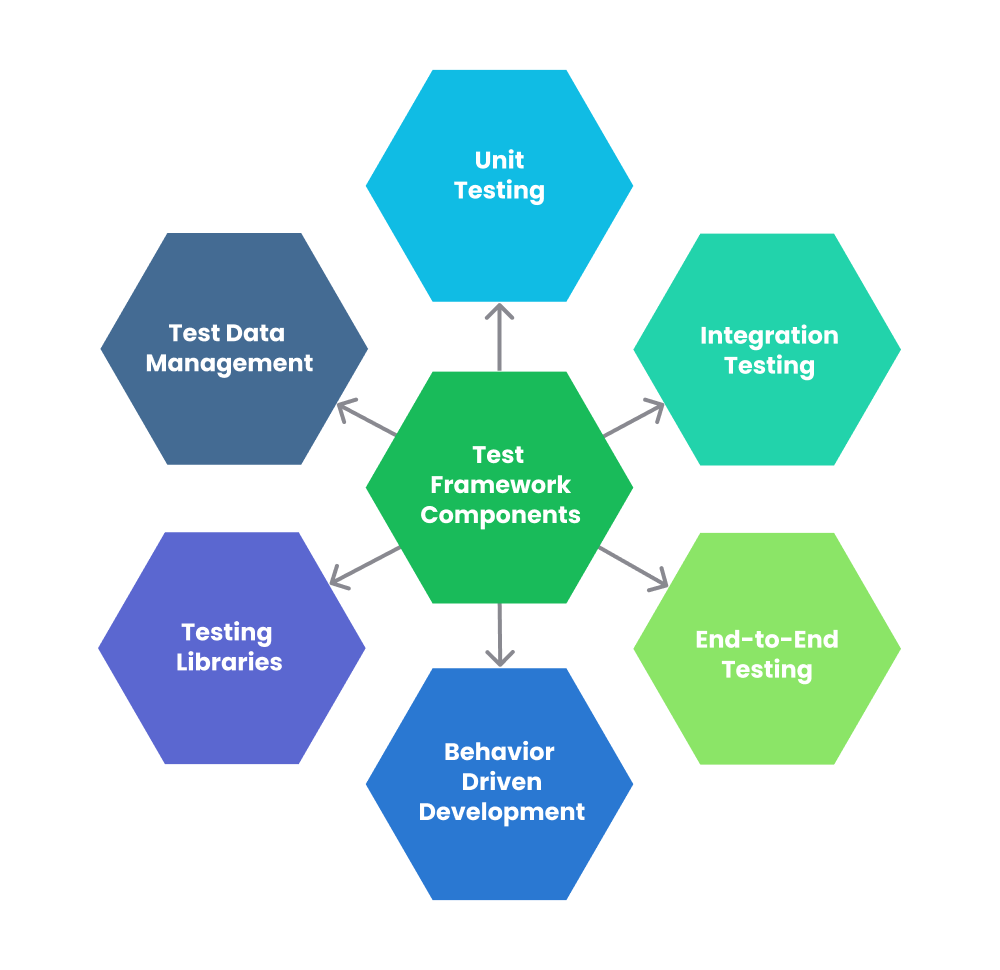

# Automation Framework Structure

### Test Automation Framework
A “Test Automation Framework” is scaffolding that is laid to provide an execution environment for the automation test scripts. The framework provides the user with various benefits that help them to develop, execute and report the automation test scripts efficiently. It is more like a system that has created specifically to automate our tests.

### Advantage of Test Automation framework

* Reusability of code
* Maximum coverage
* Recovery scenario
* Low-cost maintenance
* Minimal manual intervention
* Easy Reporting

### Types of Test Automation Framework

1. Module Based Testing Framework
2. Library Architecture Testing Framework
3. Data Driven Testing Framework
4. Keyword Driven Testing Framework
5. Hybrid Testing Framework
6. Behavior Driven Development Framework

## Components
* Test Data management
* Testing libraries
* Unit Testing
* Integration Testing
* End to End Testing 
* BDD

## API Testing Process

## Structure

### References

https://www.softwaretestinghelp.com/test-automation-frameworks-selenium-tutorial-20/

https://www.guru99.com/test-automation-framework.html

https://www.altexsoft.com/blog/api-testing/