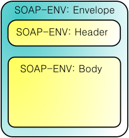
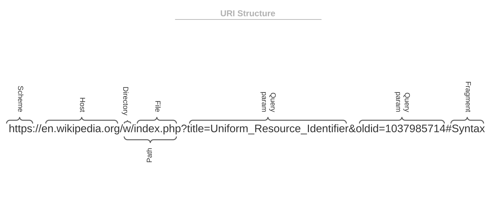
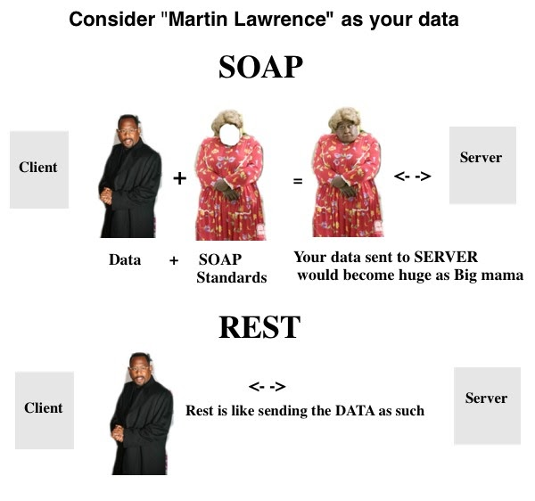

# Introduction to Web Services


## Web Services

**What are web services?**

Web services are a type of internet software that use standardized messaging protocols and are made available from an application service provider's web server for use by a client or other web-based programs.


## How web services work
Web services are built using open standards and protocols in order to integrate with various applications. The different protocols that web services use include:

* **Extensible Markup Language (XML).** This is used to tag, code and decode data.
* **Simple Object Access Protocol (SOAP).** This is used to transfer the data. The SOAP protocol was developed so that different programming languages could communicate quickly and with minimal effort.
* **Web Services Description Language (WSDL)**. This is used for telling the client application what is included in the web service and how to connect.
* **Universal Description, Discovery and Integration (UDDI)**. This is used to list what services are available within one application. It also allows web services to be discoverable to other services.
* **Representational State Transfer (REST)**. While not all web services use the REST protocol, applications built with RESTful APIs are more lightweight, manageable and scalable.


## SOAP

**SOAP (Simple Object Access Protocol)**  is a messaging protocol specification for exchanging structured information in 
the implementation of web services in computer networks. It uses XML Information Set for its message format, and relies on application layer protocols, most often Hypertext Transfer Protocol (HTTP), although some legacy systems communicate over Simple Mail Transfer Protocol (SMTP), for message negotiation and transmission

### SOAP Structure



A HTTP message with SOAP request have the following form:

```xml
POST /example HTTP/1.1
Host: example.org
Content-Type: text/xml; charset=utf-8

<?xml version="1.0"?>
<SOAP-ENV:Envelope
xmlns:SOAP-ENV="http://www.w3.org/2003/05/soap-envelope"
SOAP-ENV:encodingStyle="http://www.w3.org/2001/12/soap-encoding">
...
   <SOAP-ENV:Header>
      ...
   </SOAP-ENV:Header>

   <SOAP-ENV:Body>
      ...
   </SOAP-ENV:Body>

</SOAP_ENV:Envelope>
```


- **SOAP message**. Represents the information being exchanged between 2 SOAP nodes.
- **SOAP envelope**. It is the enclosing element of an XML message identifying it as a SOAP message.
- **SOAP header block**. A SOAP header can contain more than one of these blocks, each being a discrete computational block within the header. 
In general, the SOAP role information is used to target nodes on the path. A header block is said to be targeted at a SOAP node if the SOAP role for the header block is the name of a role in which the SOAP node operates. 
- **SOAP header**. A collection of one or more header blocks targeted at each SOAP receiver.

**SOAP Header Example**
```xml
<?xml version="1.0"?>
<soapenv:Envelope xmlns:soapenv="http://schemas.xmlsoap.org/soap/envelope/">
  <soapenv:Header>
    <wsse:Security xmlns:wsse="http://docs.oasis-open.org/wss/2004/01/oasis-200401-wss-wssecurity-secext-1.0.xsd" soapenv:mustUnderstand="1">
      <wsse:UsernameToken xmlns:wsu="http://docs.oasis-open.org/wss/2004/01/oasis-200401-wss-wssecurity-utility-1.0.xsd" wsu:Id="UsernameToken-1">
        <wsse:Username>yourusername</wsse:Username>
        <wsse:Password>yourpassword</wsse:Password>
      </wsse:UsernameToken>
    </wsse:Security>
  </soapenv:Header>
  <soapenv:Body>
    <yourbodygoeshere>
  </soapenv:Body>
</soapenv:Envelope>
```
- **SOAP body**. Contains the body of the message intended for the SOAP receiver. The interpretation and processing of SOAP body is defined by header blocks.
- **SOAP fault**. In case a SOAP node fails to process a SOAP message, it adds the fault information to the SOAP fault element. This element is contained within the SOAP body as a child element.


- SOAP protocol works in combination with **WSDL (Web Service Description Language)** is an special description language for web services. 

## REST

**RE**presentational **S**tate **T**ransfer is not based on any protocol but has a standard architecture principle used to send data over standard protocols (HTTP(s)). REST is a web service that is a result of the need of an alternative to the distributed computing based SOAP services.


### URI structure 
```commandline
scheme:[//[user[:password]@]host[:port]][/path][?query][#fragment]

https://john.doe@www.example.com:123/forum/questions?tag=networking&order=newest#top

```




RESTfull web services

**Advantages of RESTful web services:**

1. Speed: As there is no strict specification, RESTful web services are faster as compared to SOAP. It also consumes fewer resources and bandwidth.
2. Compatible with SOAP: RESTful web services are compatible with SOAP, which can be used as the implementation.
3. Language and Platform Independency: RESTful web services can be written in any programming language and can be used on any platform.
4. Supports Various Data Formats: It permits the use of several data formats like HTML, XML, Plain Text, JSON, etc.

### Request Methods
**GET**

The GET method requests that the target resource transfer a representation of its state. GET requests should only retrieve data and should have no other effect.

**HEAD**

The HEAD method requests that the target resource transfer a representation of its state, as for a GET request, but without the representation data enclosed in the response body. 

**POST**

The POST method requests that the target resource process the representation enclosed in the request according to the semantics of the target resource. For example, it is used for posting a message to an Internet forum, subscribing to a mailing list, or completing an online shopping transaction.

**PUT**

The PUT method requests that the target resource create or update its state with the state defined by the representation enclosed in the request. A distinction from POST is that the client specifies the target location on the server.

**DELETE**

The DELETE method requests that the target resource delete its state.

**CONNECT**

The CONNECT method requests that the intermediary establish a TCP/IP tunnel to the origin server identified by the request target. It is often used to secure connections through one or more HTTP proxies with TLS.

**OPTIONS**

The OPTIONS method requests that the target resource transfer the HTTP methods that it supports. This can be used to check the functionality of a web server by requesting '*' instead of a specific resource.

**TRACE**

The TRACE method requests that the target resource transfer the received request in the response body. That way a client can see what (if any) changes or additions have been made by intermediaries.

**PATCH**

The PATCH method requests that the target resource modify its state according to the partial update defined in the representation enclosed in the request. This can save bandwidth by updating a part of a file or document without having to transfer it entirely.

### Codes
The HTTP response comes with the response code. It informs about the result of the operation. It’s especially useful for UI developers, as they can perform appropriate action basing on the code. There are the following groups of HTTP response codes :

* **1xx – informational**. Indicates that the request was received and the process is continued. The examples are: 100 – Continue, 101 – Switching Protocols
* **2xx – success**. When the request was received, understood, and successfully processed. The well-known examples are 200 – OK and 201 – Created
* **3xx – redirection**. Client needs to take additional action to fulfill the request, e.g., 300 – Multiple Choice or 301 – Moved Permanently
* **4xx – client errors**. Indicates that there is an error on the client’s side, such as 400 – Bad Request or 401 – Unauthorized
* **5xx- server errors**. Informs that an error occurred on the server’s side, e.g., 500 – Internal Server Error, 501 – Unimplemented

## SOAP vs. REST


- Both process the data in distinct ways
- REST is easy, not only works with XML, can use JSON or other format
- SOAP is more secure, due to use of WS-Security *
- Error management better controlled in REST

| Parameters             | SOAP                                                                                                                                                                                                                                         | REST                                                                |
|------------------------|----------------------------------------------------------------------------------------------------------------------------------------------------------------------------------------------------------------------------------------------|---------------------------------------------------------------------|
| Full form              | It stands for Simple Object Access Protocol                                                                                                                                                                                                  | It stands for REpresentational State Transfer.                      |
| Design                 | It is a standardized protocol for pre-defined rules to follow.                                                                                                                                                                               | It has an architectural style with loose guidelines.                |	
| Statefulness           | SOAP is by default stateless, but it is possible to make this API stateful.                                                                                                                                                                  | It is stateful, i.e. no server-side sessions occur.                 |
| Approach	              | It is functional-driven, means that data here is available as services, eg, getUser                                                                                                                                                          | It is data-driven, meaning that data is available as resources.     |
| Security               | It has WS-security (Enterprise-level security) with SSL support. It also has built-in ACID(Atomicity, Consistency, Integrity, Durability) compliance which is a good feature for transactions and that’s why SOAP is used while exchanging sensitive information. | It supports HTTPS and SSL (Secure Sockets Layer)                    |
| Caching                | SOAP API calls cannot be cached.                                                                                                                                                                                                             | REST API calls can be cached.                                       |		
| Performance            | It requires more bandwidth and computing power                                                                                                                                                                                               | It requires less resources, and this makes it more powerful.        |		
| Messaging Format       | It only supports XML format.                                                                                                                                                                                                                 | It supports various formats like HTML, XML and JSON.                |
| Transfer Protocol      | It works on HTTP, SMP, UDP, etc.                                                                                                                                                                                                             | It only works on HTTPS.                                             |		
| JAVA API               | JAX-WS is the java API for SOAP web services.                                                                                                                                                                                                | JAX-RS is the java API for REST.                                    |		
| Usage with one another | SOAP cannot use REST because SOAP is a protocol and REST has an architectural style.                                                                                                                                                         | REST can use SOAP as a protocol for web services.                   |		
| Exposing methods       | SOAP uses WSDL to expose supported methods and technical details.                                                                                                                                                                            | REST exposes methods through URIs, there are no technical details.  |		
		

## Authentication

**HTTP authentication**

HTTP defines some authentication schemes that you can use directly when you are implementing REST API. The following are two of these schemes:
* **Basic authentication**. In basic authentication, the client sends the user name and password in the request header. It encodes them with base64, which is an encoding technique that converts the pair into a set of 64 characters for safe transmission.

* **Bearer authentication**. The term bearer authentication refers to the process of giving access control to the token bearer. The bearer token is typically an encrypted string of characters that the server generates in response to a login request. The client sends the token in the request headers to access resources.

* **API keys**. API keys are another option for REST API authentication. In this approach, the server assigns a unique generated value to a first-time client. Whenever the client tries to access resources, it uses the unique API key to verify itself. API keys are less secure because the client has to transmit the key, which makes it vulnerable to network theft.

* **OAuth**. OAuth combines passwords and tokens for highly secure login access to any system. The server first requests a password and then asks for an additional token to complete the authorization process. It can check the token at any time and also over time with a specific scope and longevity.

## References

https://www.guru99.com/soap-simple-object-access-protocol.html

https://en.wikipedia.org/wiki/SOAP

https://www.geeksforgeeks.org/restful-web-services/

https://documenter.getpostman.com/view/8854915/Szf26WHn#intro

https://aws.amazon.com/what-is/restful-api/

https://www.baeldung.com/cs/rest-architecture

https://www.interviewbit.com/blog/soap-vs-rest/